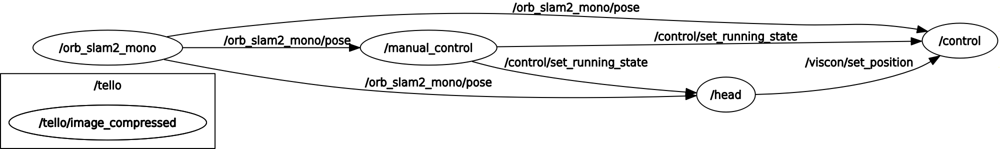
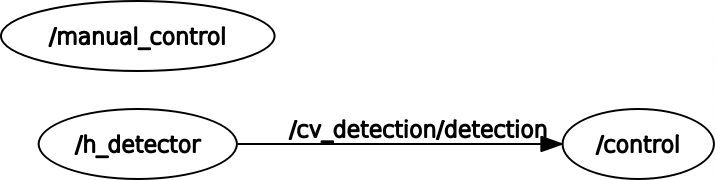

# Visual Control
Package to control MAVs using Visual Odometry Systems and Computer Vision

## 1. Control Based on Visual Odometry
This package assumes you have a Visual Odometry Package running, such as `orb_slam2_ros` or `svo` (those are the already tested ones)

### Architecture

* The node `control` sends the actual velocity commands to the MAV, according to a PID controller stabilizing the drone at the position stablished by the topic`/viscon/set_position`

* `manual_control` is a teleop_twist_keyboard based node, that controls MAV via keyboard on a terminal, with options to
    * Append positions to a trajectory
    * Save trajectory to a file - this file will be later used by `head` node to set positions.
    * Activate and deactivate autonomous control (both `head` and `control` nodes)

* `head` and reads a trajectory from a file and publishes local positions  to `/viscon/set_position` topic

### Procedure for Tello
* Run tello driver with `roslaunch tello_driver tello_node.launch`
* Set camera parameters to worse image quality (frequency is key to visual odometry algorithms) with `rosrun dynamic_reconfigure dynparam load /tello/tello [viscon]/config/dump.yaml`
* Run manual control with `roslaunch viscon manual.launch` and take it of pressing '{'
* Run visual odometry algorithm (in this case, orb_slam2_ros) with `roslaunch orb_slam2_ros orb_slam2_tello.launch` (it needs to be cloned from Skyrats repository)
* Watch it's functioning on **rqt** GUI with `rosrun rqt rqt -d [orb_slam2_ros]/ros/config/rviz_config.rviz`
* Save positions on the manual controller with 's'
* Save trajectory with 'f'
* run `rosrun viscon head.py`
* run `rosrun viscon control.py`
* Finally, press 'a' on the manual controller to enable autonomous mode!

Have fun!

## 2. Control Based on Computer Vision
We can also control our MAV based on it's position relative to an object detected by it's camera

### Architecture

### Procedure for Tello
* Run tello driver with `roslaunch tello_driver tello_node.launch`
* Set camera parameters to worse image quality (frequency is key to visual odometry algorithms) with `rosrun dynamic_reconfigure dynparam load /tello/tello [viscon]/config/dump.yaml`
* Run manual control with `roslaunch viscon manual.launch` and take it of pressing '{'
* Run `cv_detection`'s `h_node` with `rosrun cv_detection h_node`
    * This node detects an H in the webcam image and publishes its position in `/cv_detection/h_detection` as a custom message `H_info.msg` which contains:
        * `detected`: boolean that shows if H was detecetd
        * `center_x`: x coordinate of H's center
        * `center_y`: y coordinate of H's center
        * area_ratio: ratio between H's area and that of the entire image

* Run `control` node with `rosrun viscon cv_control.py`

To use dynamic_reconfigure, `rosrun rqt_gui rqt_gui -s reconfigure` along with the simple_control.py node

### Procedure for MAVROS (using [simulation](https://github.com/SkyRats/simulation) package)
* Run `simulate.sh` script
    * **Check** if last line is `roslaunch simulation H_world.launch`

    `rosrun simulation simulate.sh`
* Run `roslaunch viscon cv_control.launch` - [depends on cv_detection](https://github.com/SkyRats/cv_detection), it runs
    * cv_detection's `h_node`
    * viscon's `run_h_mission.py`
    * viscon's `cv_control.py`

Result should look something like this
